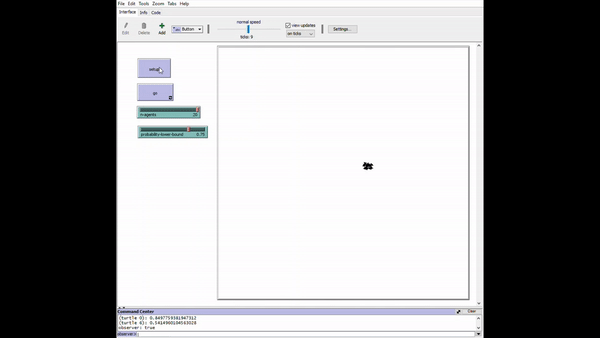

Multi Agent Systems Seminar

This small work is done while participating in a seminar in multi-agent systems. 
I present here an approach to the gathering problem in a probabilistic model when the connectivity between the agents might disconnect with a certain probability.
My work contains a mathematical and geometric approach to the problem.
a simple mathematical background to my ideas and the full motion rule is provided in the attached PDF file.
also, a small simulation (NetLogo) is supplied to get the sense of the model ideas and base condition

